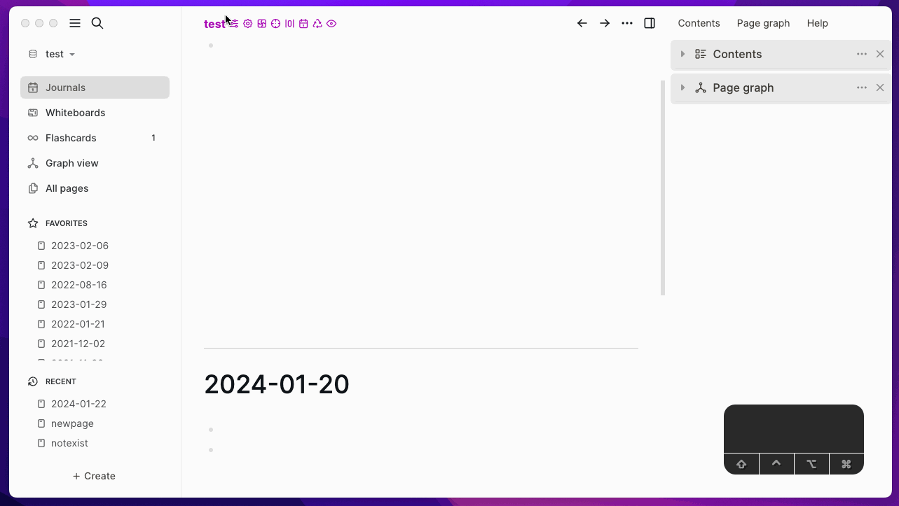

# Logseq Title Bar

Show graph title and some quick actions in the title bar.

## Main features

- Show graph title in the title bar, title bar is on the left top of the Logseq main area.
- Some useful quick actions in the title bar.
- Set default action for clicking the graph title Plugin Settings page.
- Toggle actions on Plugin Settings page
- Set title color on Plugin Settings page

## Actions

The action identifiers are as follows:

- openTitleBarSettings,
- openPluginSettings,
- openMarketplace,
- focusMainContent,
- showAllSidebars,
- goToday,
- goSidebarTempPage,
- toggleReadonly,

## ❤️ Buy me a coffee

If this plugin solve your situation a little bit and you will, you can choose to buy me a coffee via [this](https://www.buymeacoffee.com/vipzhicheng) and [this](https://afdian.net/@vipzhicheng), that means a lot to me.

## Licence

MIT
